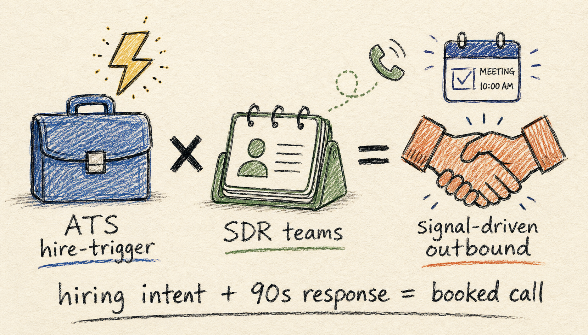
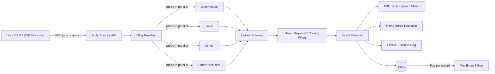

# ATS Hire-Trigger Intent Scraper



[](https://apify.com/george.the.developer/ats-hire-trigger-intent-scraper) [](#pricing) [](#use-cases)

Pull jobs from Greenhouse, Lever, Ashby, and SmartRecruiters in one API. Intent-enriched with tech-keyword extraction, hiring-surge detection, and first-in-function flags. Built for SDR teams running buying-intent outreach. Pay per result, no seat license.

Live at: https://apify.com/george.the.developer/ats-hire-trigger-intent-scraper

## Why this exists

TheirStack at $59-$2,078/mo gates the data behind credit packs that expire. Crunchbase intent feeds run $99/mo per seat. The existing Apify ATS scrapers do raw extraction and stop there, no tech-keyword post-processing, no hiring-surge detection. SDRs want "give me the 30 companies hiring Sales Engineers AND mention Salesforce in the JD AND posted in last 7 days." That requires post-processing the JD text, not just dumping it. This scraper does that, returns clean unified records, and charges only for results returned.

## What you get per record

```json
{
  "ats_platform": "greenhouse",
  "company": "stripe",
  "job_id": "7532733",
  "job_url": "https://stripe.com/jobs/search?gh_jid=7532733",
  "job_title": "Account Executive, AI Sales",
  "department": "Enterprise - Account Executives (NA)",
  "posted_at": "2026-05-04",
  "location": "San Francisco, CA",
  "remote_policy": null,
  "salary_min": null,
  "salary_max": null,
  "salary_currency": null,
  "seniority": "mid",
  "intent_signals": {
    "tech_keywords": ["Stripe", "OpenAI", "Anthropic"],
    "first_in_function": false,
    "hiring_surge": false,
    "department_count_14d": 1
  }
}
```

## Architecture



## Endpoints

| Method | Path | Purpose | Charge |
|---|---|---|---|
| GET | `/` | Service info | none |
| GET | `/health` | Health check | none |
| GET | `/jobs?company=stripe.com&limit=50` | Raw jobs from one company across any ATS | $0.005 per job |
| GET | `/search?keyword=engineer&companies=a.com,b.com` | Cross-company keyword search | $0.005 per job |
| GET | `/enrich?company=stripe.com&keyword=sales&limit=50` | Intent-enriched jobs (tech keywords + surge + first-in-function) | $0.015 per job |
| POST | `/enrich/bulk` | Up to 50 companies in one call | $0.015 per job |

## Quick start (curl)

```bash
TOKEN="<your-apify-token>"

# 50 jobs from Stripe across whichever ATS they use
curl "https://george-the-developer--ats-hire-trigger-intent-scraper.apify.actor/jobs?company=stripe.com&limit=50" \
  -H "Authorization: Bearer $TOKEN"

# Engineering jobs at Stripe with intent enrichment
curl "https://george-the-developer--ats-hire-trigger-intent-scraper.apify.actor/enrich?company=stripe.com&keyword=engineer&days=14&limit=20" \
  -H "Authorization: Bearer $TOKEN"
```

See [examples/](examples/) for Node.js and Python.

## Pricing

| Event | Price | Description |
|---|---|---|
| `job-listing` | $0.005 | One job pulled from Greenhouse, Lever, Ashby, or SmartRecruiters |
| `job-intent-enriched` | $0.015 | Job with tech-keyword extraction, hiring-surge flag, first-in-function flag |

Compare to TheirStack ($59-$2,078/mo subscription with monthly credit packs that expire), Crunchbase Pro ($99/mo per seat), Coresignal (enterprise contracts). This is pay per result, no monthly minimum, no seat license.

## Use cases

1. **SaaS SDR outreach.** "Give me companies hiring Sales Engineers AND mentioning Salesforce in the JD." `intent_signals.tech_keywords` filters this in one pass.
2. **Modern Treasury / Mercury / Brex GTM.** Find companies hiring a Controller or VP of Finance. Buying signal arrives 60-90 days before vendor research.
3. **Vanta / Drata / SecureFrame outbound.** Find companies hiring their first Security Engineer or CISO. `first_in_function: true` captures this directly.
4. **DevRel hiring as a signal.** Companies posting their first Developer Advocate are about to launch a public API. Time the outreach.
5. **Recruiting agency talent mapping.** Pull all engineering jobs from 50 portfolio companies in one bulk call. Bypass LinkedIn rate limits.

## Intent signals (v1)

- **tech_keywords**: regex match against 100 common B2B tools across data warehouse (Snowflake, Databricks, BigQuery), CRM (Salesforce, HubSpot, Outreach, Gong), payments (Stripe, Adyen, Chargebee), cloud (AWS, GCP, Azure, Cloudflare), observability (Datadog, Splunk, Sentry), security (Okta, Vanta, Drata), AI (OpenAI, Anthropic, Pinecone), and more.
- **hiring_surge**: counts jobs in the same department posted in the last 14 days. Flags `true` if the count is 5 or more.
- **first_in_function**: title pattern match for "first {role}", "founding {role}", "head of {role}", "VP of {role}".
- **department_count_14d**: raw 14-day count for that department, useful for ranking by hiring intensity.

v2 expands to salary parsing across more JD formats, NLP-based responsibility tagging, and Workday adapter for the Fortune 1000 long tail.

## Honest tradeoffs

- ATS auto-discovery probes all four platforms in parallel, fast but adds 1-2s on the first call per company. Once known, the platform is cached.
- Workday is supported in v2 (POST JSON API, tenant-discovery is harder than the other four). v1 covers Greenhouse, Lever, Ashby, SmartRecruiters which together cover ~230k companies.
- Salary extraction from JD text catches `$100k - $150k` and `$100,000 - $150,000` patterns. Workday and SmartRecruiters often hide salary in structured fields not in JD text; v2 reads those.
- Some companies use a custom ATS slug that does not match the company domain stem. v2 will fall back to a careers-page parse to discover the slug.
- Cold-start latency on first call after idle (~10-30s while Apify wakes the standby actor).

## License

MIT for the docs and examples in this repo. The actor itself runs on Apify Cloud.
